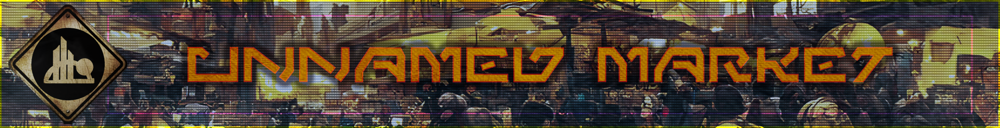

# SWC Unnamed Imperium - Market



## Setup

```shell
git clone https://github.com/swc-unnamed/market

cd market

pnpm install
```

Copy the `.env.example` to `.env` and update the file. At the time of this writing, a Combine account is required and you will need to get a web service account setup. Reach out to the ASIMs to get one approved. Marc might be able willing to provide client creds, but would prefer each developer obtains their own for security reasons.

Once you get your env file setup, you are ready to run the migrations and seed your local database.

```shell
pnpm db:push # Will push the local schema to your local.db file

pnpm db:seed # Will seed your assets table with combine assets
```

You are now good to run the app

```shell
pnpm run dev
```

> [!IMPORTANT]  
> The first build will always take the longest as it's building your cache, it's okay! If you want to speed this up, run `pnpm build` before you run `pnpm dev`

## Development

- UI Market utilizing [TailwindCSS](https://tailwindcss.com/docs/installation) for it's CSS needs.
- Component library that is utlized is [shadcn svelte](https://next.shadcn-svelte.com/docs)
- Base libarary is SvelteKit and Svelte 5
- UI Market only plans for dark mode usage, because we care about your eyes even if you dont ❤️
- ORM is [drizzle](https://orm.drizzle.team/)
- Icon set is [Iconfiy](https://icon-sets.iconify.design/)

## Testing

I don't typically write tests as I personally find TDD to be a waste of time. Instead, if there is an edge case for things, I would typically write a test to just test that edge case.
